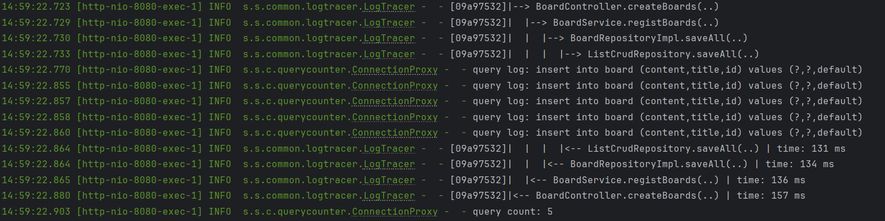
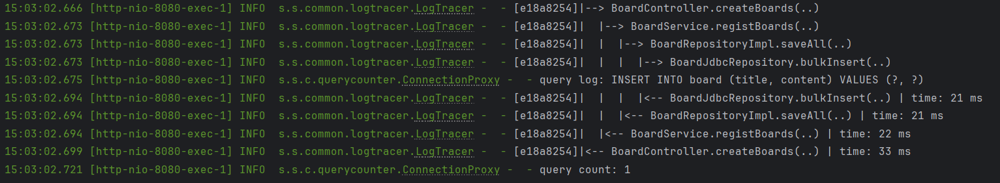

# Log Tracer

- Spring AOP, ThreadLocal 사용
- 각 비즈니스 레이어 메서드 마다 호출 시간, 접근 레벨 표시

### 사용처

운영 환경에서 예외 상황 발생 시 어디서 발생했는지 확인 가능

호출 시간을 통해 이상있는지 확인

### 문제점

- 에러 로깅 시 controller 반환될 때 까지 로깅 반복 출력

# Query Counter

- Spring AOP, JDK Dynamic Proxy 사용
- query count, query log 출력 구현

### 사용

쿼리를 비교하여 JPA 및 JDBC 모듈을 사용할 시 최적화에 도움을 줄 수 있다.

### 문제점

- 확장성 설계

---

[Logging - spring boot docs 3.3.4](https://docs.spring.io/spring-boot/reference/features/logging.html#features.logging.log-format)

[Proxying Mechanisms - spring framework docs 6.1.13](https://docs.spring.io/spring-framework/reference/core/aop/proxying.html)

[스프링 고급편 - 김영한]()

[Holder 패턴 - effective programming](https://effectiveprogramming.tistory.com/entry/Holder-%ED%8C%A8%ED%84%B4)

외 기타 github 예제 프로젝트 등에서 참고했습니다.